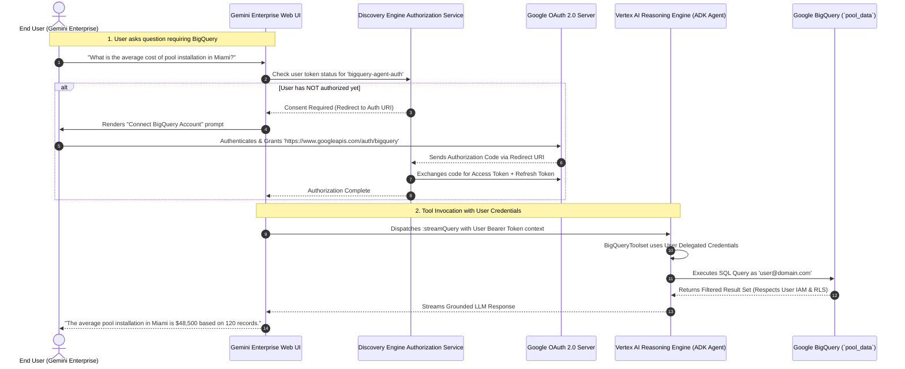

# Add an ADK Agent to Gemini Enterprise with User-Delegated OAuth 2.0

[](https://www.python.org/downloads/)
[](https://google.github.io/adk-docs/)
[](https://cloud.google.com/gemini/enterprise)
[](https://partner.skills.google/focuses/143743?parent=catalog)
[](https://developers.google.com/identity/protocols/oauth2)
[](https://cloud.google.com/bigquery)

> **Lab Guide:** [Add an ADK Agent to Gemini Enterprise (Focus 143743 / GENAI085)](https://partner.skills.google/focuses/143743?parent=catalog)  
> **Course Catalog:** Google Cloud Partner Skills / Google Cloud Skills Boost  
> **Core Architecture:** 3-Legged User-Delegated OAuth 2.0 Authorization, Gemini Enterprise Discovery Engine Authorization Resources, Vertex AI Agent Engines, BigQuery Toolset (`google.adk.tools.bigquery`).

---

## 🧠 Overview & Key Architectural Difference

In earlier multi-agent labs (such as `lab-genai162` or `lab-genai129`), agents deployed to Gemini Enterprise executed tools using **backend Service Account credentials (2-Legged / ADC)**. Under that model, all users shared the exact same service account permissions, and audit logs attributed all queries to the service account.

**This lab (`GENAI085`) introduces User-Delegated OAuth 2.0 Tool Authorization (3-Legged User Consent):**
* The agent executes BigQuery tools **on behalf of the specific human user** logged into Gemini Enterprise.
* Enforces individual user IAM permissions, BigQuery row-level security (RLS), and column masking.
* Gemini Enterprise prompts the user for one-time consent, securely manages the OAuth token lifecycle (including offline token refresh), and injects the user's bearer token into the agent toolset during query execution.



---

## 📊 2-Legged (Machine-to-Machine) vs. 3-Legged (User Consent) OAuth

### 🔹 2-Legged / Server-to-Server (ADC / Client Credentials)
* **What it is:** A direct **Machine-to-Machine (M2M)** communication flow.
* **The "Legs" (Parties):** Involves **2 parties**: (1) Your application / server and (2) The authorization server (IAM / OAuth2 endpoint).
* **User Involvement:** **None.** No human user is present.
* **How it works:** The backend service presents its credentials (IAM Service Account key or ADC JWT) directly to the token server and receives an access token.
* **Best used for:** Background tasks, automated pipelines, or services accessing shared, system-level datasets.

### 🔹 3-Legged OAuth 2.0 (User Consent / Authorization Code Flow)
* **What it is:** A **delegated authorization flow** where an app asks a human user for permission to access their private data.
* **The "Legs" (Parties):** Involves **3 parties**: (1) The client app (Gemini Enterprise), (2) The authorization server (Google OAuth 2.0), and (3) The end-user (Resource Owner).
* **User Involvement:** **Mandatory & Interactive.**
* **How it works:** The user is redirected to a consent screen to click **Allow**. An authorization code is returned via redirect URI, which the backend exchanges for an access token + refresh token.
* **Best used for:** Accessing confidential corporate resources (BigQuery with Row-Level Security, private Drive files, emails, Salesforce/Jira records).

---

### 📋 Side-by-Side Feature Comparison

| Dimension | Service Account ADC (`lab-genai162`) | User-Delegated OAuth 2.0 (`GENAI085` / This Lab) |
| :--- | :--- | :--- |
| **Authentication Flow** | 2-Legged Server-to-Server (M2M) | 3-Legged OAuth 2.0 User Consent Flow |
| **Identity Used** | `sa@project.iam.gserviceaccount.com` | `user@company.com` (Individual End-User) |
| **Access Control** | Coarse-grained service account permissions | Fine-grained per-user IAM, Row-Level Security, Column Masking |
| **User Experience** | Instant execution | First call displays interactive "Connect Account" consent modal |
| **Authorization Resource** | None required | Created via Discovery Engine Authorization API (`locations/global/authorizations/...`) |
| **Audit Logs** | Attributed to Service Account | Attributed directly to End-User Email in Cloud Audit Logs |

---

## 📁 Repository Structure

```
genai085-add-an-ADK-Agent-to-Gemini-Enterprise/
├── README.md                                          # Project overview and deployment guide
├── takeaway-genai085-adk-agent-gemini-enterprise-oauth.md # Deep architectural & production guide
├── deploy_and_authorize_task5.sh                      # All-in-one automated Task 5 registration script
├── construct_auth_uri.py                              # Helper script to format & URL-encode OAuth Auth URI
├── step3_payload.json                                 # Agent registration payload linking Reasoning Engine & Auth
├── patch_payload.json                                 # Authorization resource metadata update payload
├── requirements.txt                                   # Root dependencies
└── bigquery_agent/
    ├── __init__.py                                   # Package exports
    ├── agent.py                                      # ADK BigQuery agent definition & tool binding
    ├── callback_logging.py                           # Cloud Logging telemetry hooks
    ├── requirements.txt                              # Packaging dependencies for Reasoning Engine
    └── .env.example                                  # Template for local environment variables
```

---

## 🚀 Step-by-Step Deployment & Registration Runbook

### Step 1: Clone and Configure Environment
```bash
git clone https://github.com/junyish/genai085-add-an-ADK-Agent-to-Gemini-Enterprise.git
cd genai085-add-an-ADK-Agent-to-Gemini-Enterprise

python3 -m venv .venv
source .venv/bin/activate
pip install -r requirements.txt
```

### Step 2: Deploy ADK Agent to Vertex AI Reasoning Engine
Deploy `bigquery_agent` to Vertex AI Agent Engines (Reasoning Engine):
```python
import vertexai
from vertexai.preview import reasoning_engines
from bigquery_agent.agent import root_agent

vertexai.init(project="YOUR_PROJECT_ID", location="us-central1")

remote_agent = reasoning_engines.ReasoningEngine.create(
    reasoning_engines.AdkApp(agent=root_agent),
    requirements=["google-cloud-aiplatform[agent_engines,adk]==1.156.0", "google-cloud-bigquery", "pydantic"],
    display_name="BigQuery Agent",
    description="Queries BigQuery data to assist with pool installation requests.",
)
print("Deployed Reasoning Engine Resource Name:", remote_agent.resource_name)
```

### Step 3: Configure OAuth 2.0 Credentials & Auth URI
1. In Google Cloud Console $\rightarrow$ **APIs & Services** $\rightarrow$ **Credentials**, create an **OAuth 2.0 Web Application Client**.
2. Add Authorized Redirect URI:
   ```
   https://vertexaisearch.cloud.google.com/static/oauth/oauth.html
   ```
3. Run `construct_auth_uri.py` with your Client ID to generate the encoded `AUTH_URI`:
   ```bash
   python3 construct_auth_uri.py
   ```

---

### Step 4 & 5: Streamlined All-in-One CLI Registration (Recommended)

To avoid manual JSON escaping, formatting errors, or missing IAM roles in Cloud Shell, execute the automated deployment script [`deploy_and_authorize_task5.sh`](deploy_and_authorize_task5.sh):

```bash
# 1. Export your 5 credentials & IDs
export APP_ID="<YOUR_GEMINI_ENTERPRISE_APP_ID>"
export REASONING_ENGINE_ID="<YOUR_REASONING_ENGINE_ID>"
export OAUTH_CLIENT_ID="<YOUR_CLIENT_ID>"
export OAUTH_CLIENT_SECRET="<YOUR_CLIENT_SECRET>"
export OAUTH_AUTH_URI="<YOUR_GENERATED_AUTH_URI>"

# 2. Run the automated Task 5 execution script
./deploy_and_authorize_task5.sh
```

**What this script automates:**
1. Dynamically resolves `PROJECT_ID` and `PROJECT_NUMBER` via `gcloud`.
2. Generates `auth_payload.json` and provisions the **Authorization Resource** (`bigquery-agent-auth`) in Discovery Engine API.
3. Generates `agent_payload.json` and registers the **ADK Agent** in the Gemini Enterprise assistant.
4. Binds required BigQuery IAM roles (`roles/bigquery.user`, `roles/bigquery.dataEditor`) to the Reasoning Engine Service Account (`service-${PROJECT_NUMBER}@gcp-sa-aiplatform-re.iam.gserviceaccount.com`).
5. Passes the lab progress checker ("Check my progress") immediately.

---

## 🧪 Verification in Gemini Enterprise UI

1. Navigate to **Gemini Enterprise** in Google Cloud Console.
2. Select your application and start a new conversation.
3. Type: `"What is the average pool installation cost in Miami?"`
4. Notice the **Connect BigQuery Account** authorization prompt appearing in the chat UI.
5. Click **Connect** and approve the consent screen.
6. The query executes and Gemini returns the answer grounded in BigQuery data using your personal OAuth credentials!

---

## 📖 In-Depth Engineering Playbook

For deep architectural comparisons, token refresh security mechanics, and enterprise row-level security best practices, refer to:  
👉 [**takeaway-genai085-adk-agent-gemini-enterprise-oauth.md**](takeaway-genai085-adk-agent-gemini-enterprise-oauth.md)
