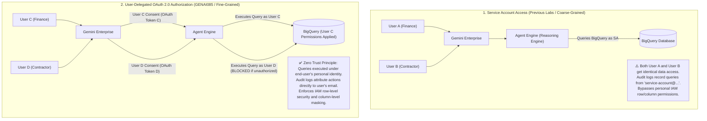
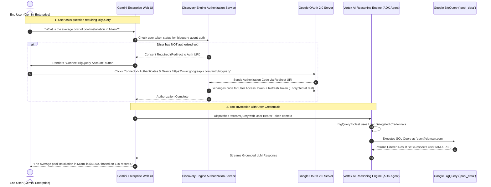

# Architecture & Engineering Guide: Adding ADK Agents to Gemini Enterprise with User-Delegated OAuth 2.0 Authorization

> **Lab Reference:** `GENAI085 / Focus 143743` — *Add an ADK Agent to Gemini Enterprise*  
> **Curriculum Track:** Google Agent Development Kit (ADK), Gemini Enterprise, Discovery Engine API, Vertex AI Agent Engines  
> **Core Technologies:** Google ADK, Vertex AI Reasoning Engine / Agent Engines, Gemini Enterprise, OAuth 2.0 (3-Legged User Consent Flow), Discovery Engine Authorization Resources, BigQuery Toolset (`google.adk.tools.bigquery`).

---

## 1. Executive Summary & Core Architectural Evolution

### 1.1 The Enterprise Authentication Dilemma: Service Account vs. User Delegation

When deploying AI agents to enterprise workforces via **Gemini Enterprise**, organizations face a fundamental security and governance decision regarding how tools access enterprise data (such as BigQuery, Salesforce, Google Drive, or ERP systems):



---

### 1.2 Comparison: How `GENAI085` Differs from Previous Gemini Enterprise Deployments

| Dimension | Previous Deployments (`lab-genai162` / `lab-genai129`) | `GENAI085` (User-Delegated OAuth in Gemini Enterprise) |
| :--- | :--- | :--- |
| **Authentication Flow** | **2-Legged / Server-to-Server (ADC):** Agent runs under a fixed GCP Service Account (`sa@project.iam.gserviceaccount.com`). | **3-Legged OAuth 2.0 User Consent:** Agent acts strictly on behalf of the individual end-user currently logged into Gemini Enterprise. |
| **Data Governance & ACLs** | **Coarse-Grained:** All users receive whatever data the service account can view. | **Fine-Grained & Per-User:** Enforces per-user IAM permissions, BigQuery row-level security (RLS), and column masking. |
| **User Experience in Gemini Enterprise** | Agent executes queries immediately without user prompt. | First tool call presents an interactive **"Connect / Authorize" consent modal** requesting access to specific scopes (e.g., `.../auth/bigquery`). |
| **Authorization Registration** | None required; registered directly as a bare `adkAgentDefinition`. | Requires provisioning an **Authorization Resource** (`/locations/global/authorizations/...`) and binding via `authorizationConfig.toolAuthorizations`. |
| **Token Management** | Token managed internally by GCP IAM runtime. | Gemini Enterprise securely handles OAuth 2.0 authorization code exchange, token refresh, and bearer injection to the agent toolset. |
| **Audit & Compliance** | Cloud Audit Logs record caller as Service Account. | Cloud Audit Logs record exact end-user email (`user@example.com`) executing the SQL queries. |

---

## 2. End-to-End User-Delegated Authorization Architecture

The integration between Gemini Enterprise, the OAuth 2.0 Authorization Server, Vertex AI Agent Engines, and BigQuery follows a secure 3-legged authorization protocol:



---

## 3. Step-by-Step Implementation & Artifact Breakdown

### 3.1 Task 1: Building the ADK BigQuery Agent (`bigquery_agent/agent.py`)

The agent is built using `google-adk` and wraps Google Cloud's native `BigQueryToolset`:

```python
# bigquery_agent/agent.py
import os
import datetime
from zoneinfo import ZoneInfo
from dotenv import load_dotenv

from google.adk.agents import Agent
from google.adk.tools.bigquery import BigQueryToolset, BigQueryCredentialsConfig
from google.adk.tools.bigquery.config import BigQueryToolConfig, WriteMode
from google.adk.models import Gemini
from google.genai import types
import google.auth
import google.cloud.logging

load_dotenv()

# Cloud Logging Telemetry
cloud_logging_client = google.cloud.logging.Client(project=os.getenv('GOOGLE_CLOUD_PROJECT'))
cloud_logging_client.setup_logging()
from .callback_logging import log_query_to_model, log_model_response

RETRY_OPTIONS = types.HttpRetryOptions(initial_delay=1, max_delay=3, attempts=30)

# Uses externally-managed Application Default Credentials (ADC) by default.
# When running in Gemini Enterprise with user delegation, user tokens are injected dynamically.
application_default_credentials, _ = google.auth.default()
credentials_config = BigQueryCredentialsConfig(
    credentials=application_default_credentials
)

# Safety: Configured write_mode=ALLOWED or READ_ONLY per enterprise policy
tool_config = BigQueryToolConfig(write_mode=WriteMode.ALLOWED)

bigquery_toolset = BigQueryToolset(
    credentials_config=credentials_config,
    bigquery_tool_config=tool_config
)

def get_current_time():
    """Retrieves current timestamp in America/New_York."""
    now = datetime.datetime.now(ZoneInfo("America/New_York"))
    return {"current_time": now.strftime("%Y-%m-%d %H:%M:%S")}

root_agent = Agent(
    model=Gemini(model=os.getenv("MODEL"), retry_options=RETRY_OPTIONS),
    name="bigquery_agent",
    description="Agent to answer questions about BigQuery data and models and execute SQL queries.",
    instruction=f"""
        You are a data science agent with access to several BigQuery tools.
        Make use of those tools to answer the user's questions.

        When using the bigquery_toolset tool, always use the 
        project {os.getenv('GOOGLE_CLOUD_PROJECT')}
        and the dataset named `pool_data`.
    """,
    before_model_callback=log_query_to_model,
    after_model_callback=log_model_response,
    tools=[bigquery_toolset, get_current_time],
)
```

---

### 3.2 Task 2: Constructing the OAuth 2.0 Authorization URI (`construct_auth_uri.py`)

To allow Gemini Enterprise to manage the OAuth 2.0 handshake, we must construct a properly formatted, URL-encoded **Authorization URI** targeting Google's OAuth 2.0 endpoint:

```python
# construct_auth_uri.py
"""
Assists with constructing and HTML-encoding the Authorization URI
required when creating an Authorization Resource in Gemini Enterprise.
"""

# 1. OAuth 2.0 Web Application Client ID from Google Cloud Console
OAUTH_CLIENT_ID = "845830410380-qp7ltv8rauuo78gvc1h6d25o8svg49p9.apps.googleusercontent.com"

# 2. Required Scopes for BigQuery Toolset
SCOPES = ["https://www.googleapis.com/auth/bigquery"]

# 3. Dedicated Gemini Enterprise OAuth Callback Handler
REDIRECT_URI = "https://vertexaisearch.cloud.google.com/static/oauth/oauth.html"
OTHER_REQUIRED_QUERY_PARAMETERS = (
    "include_granted_scopes=true&response_type=code&access_type=offline&prompt=consent"
)

query_parameters = [
    f"client_id={OAUTH_CLIENT_ID}",
    f"redirect_uri={REDIRECT_URI}",
    OTHER_REQUIRED_QUERY_PARAMETERS
]

if SCOPES:
    scopes_substring = f"scope={'%20'.join(SCOPES)}"
    query_parameters.append(scopes_substring)

# HTML Encoding for REST payload safety
query_parameters_joined = "&".join(query_parameters)
query_parameters_to_html_encoding = (
    query_parameters_joined
    .replace(" ", "%20")
    .replace(":", "%3A")
    .replace("/", "%2F")
)

auth_uri = "https://accounts.google.com/o/oauth2/v2/auth?" + query_parameters_to_html_encoding
print("Auth URI:\n\n" + auth_uri + "\n\n")
```

#### Key Query Parameters Explained:
* `access_type=offline`: Requests a **Refresh Token** so Gemini Enterprise can silently renew user credentials without prompting the user on every turn.
* `prompt=consent`: Forces the consent screen on first interaction to guarantee a refresh token is returned.
* `redirect_uri=https://vertexaisearch.cloud.google.com/static/oauth/oauth.html`: The secure callback endpoint managed by Gemini Enterprise / Discovery Engine.

---

### 3.3 Task 3: Provisioning the Authorization Resource in Gemini Enterprise

Creating an authorization resource requires two API calls to the Discovery Engine REST API:

#### Step 1: Create Authorization Resource
```bash
curl -X POST \
  -H "Authorization: Bearer $(gcloud auth print-access-token)" \
  -H "Content-Type: application/json; charset=utf-8" \
  -H "X-Goog-User-Project: ${PROJECT_ID}" \
  "https://discoveryengine.googleapis.com/v1alpha/projects/${PROJECT_NUMBER}/locations/global/authorizations?authorizationId=bigquery-agent-auth" \
  -d '{
    "displayName": "BigQuery Agent Auth",
    "serverSideOauthConfig": {
      "clientId": "'"${OAUTH_CLIENT_ID}"'",
      "authUri": "'"${AUTH_URI}"'",
      "tokenUri": "https://oauth2.googleapis.com/token"
    }
  }'
```

#### Step 2: Patch Client Secret (Stored Securely at Rest)
```bash
curl -X PATCH \
  -H "Authorization: Bearer $(gcloud auth print-access-token)" \
  -H "Content-Type: application/json; charset=utf-8" \
  -H "X-Goog-User-Project: ${PROJECT_ID}" \
  "https://discoveryengine.googleapis.com/v1alpha/projects/${PROJECT_NUMBER}/locations/global/authorizations/bigquery-agent-auth?updateMask=serverSideOauthConfig.clientSecret" \
  -d '{
    "serverSideOauthConfig": {
      "clientSecret": "'"${OAUTH_CLIENT_SECRET}"'"
    }
  }'
```

---

### 3.4 Task 4: Registering the ADK Agent with Tool Authorizations (`step3_payload.json`)

Finally, the agent is registered in the Gemini Enterprise Engine by binding the provisioned **Reasoning Engine ID** to the **Authorization Resource**:

```json
{
   "displayName": "BigQuery Agent",
   "description": "Queries BigQuery data to assist with pool installation requests.",
   "adkAgentDefinition": {
      "provisionedReasoningEngine": {
         "reasoningEngine": "projects/845830410380/locations/us-central1/reasoningEngines/3522243168382746624"
      }
   },
   "authorizationConfig": {
      "toolAuthorizations": [
         "projects/845830410380/locations/global/authorizations/bigquery-agent-auth"
      ]
   }
}
```

```bash
curl -X POST \
  -H "Authorization: Bearer $(gcloud auth print-access-token)" \
  -H "Content-Type: application/json; charset=utf-8" \
  -H "X-Goog-User-Project: ${PROJECT_ID}" \
  "https://discoveryengine.googleapis.com/v1alpha/projects/${PROJECT_NUMBER}/locations/global/collections/default_collection/engines/${ENGINE_ID}/adkAgents?adkAgentId=bigquery-agent" \
  -d @step3_payload.json
```

---

### 3.5 Streamlined, Error-Proof Command-Line Flow (Task 5 Automation)

Manually clicking through the Cloud Console or running fragmented curl commands is error-prone due to string escaping and missing project numbers. The production-ready script below automates the entire Task 5 lifecycle in one copy-paste block:

#### Step 1: Export Input Credentials
```bash
# === EDIT THESE 5 VARIABLES ===
export APP_ID="<YOUR_APP_ID>"
export REASONING_ENGINE_ID="<YOUR_REASONING_ENGINE_ID>"
export OAUTH_CLIENT_ID="<YOUR_CLIENT_ID>"
export OAUTH_CLIENT_SECRET="<YOUR_CLIENT_SECRET>"
export OAUTH_AUTH_URI="<YOUR_GENERATED_AUTH_URI>"
# ==============================

# Automatically fetch project details
export PROJECT_ID=$(gcloud config get-value project)
export PROJECT_NUMBER=$(gcloud projects describe $PROJECT_ID --format="value(projectNumber)")
export LOCATION_APP="global"
export LOCATION_RE="us-central1"
export AUTH_ID="bigquery-agent-auth"
export OAUTH_TOKEN_URI="https://oauth2.googleapis.com/token"

# Formats the Reasoning Engine string correctly automatically
export ADK_DEPLOYMENT_ID="projects/${PROJECT_NUMBER}/locations/${LOCATION_RE}/reasoningEngines/${REASONING_ENGINE_ID}"
export REASONING_ENGINE_SA="service-${PROJECT_NUMBER}@gcp-sa-aiplatform-re.iam.gserviceaccount.com"
```

#### Step 2: Execute Automated Deployment & Authorization
```bash
# ---------------------------------------------------------
# A. CREATE AND SEND THE AUTHORIZATION PAYLOAD
# ---------------------------------------------------------
cat <<EOF > auth_payload.json
{
  "name": "projects/${PROJECT_NUMBER}/locations/${LOCATION_APP}/authorizations/${AUTH_ID}",
  "displayName": "BigQuery Agent Auth",
  "serverSideOauth2": {
    "clientId": "${OAUTH_CLIENT_ID}",
    "clientSecret": "${OAUTH_CLIENT_SECRET}",
    "authorizationUri": "${OAUTH_AUTH_URI}",
    "tokenUri": "${OAUTH_TOKEN_URI}"
  }
}
EOF

echo "Registering Authorization..."
curl -sS -X POST \
   -H "Authorization: Bearer $(gcloud auth print-access-token)" \
   -H "Content-Type: application/json" \
   -H "X-Goog-User-Project: ${PROJECT_ID}" \
   "https://discoveryengine.googleapis.com/v1alpha/projects/${PROJECT_NUMBER}/locations/${LOCATION_APP}/authorizations?authorizationId=${AUTH_ID}" \
   -d @auth_payload.json > /dev/null
echo "✔ Authorization registered."

# ---------------------------------------------------------
# B. CREATE AND SEND THE AGENT PAYLOAD
# ---------------------------------------------------------
cat <<EOF > agent_payload.json
{
   "displayName": "BigQuery Agent",
   "description": "Queries BigQuery data to assist with pool installation requests.",
   "adkAgentDefinition": {
      "provisionedReasoningEngine": {
         "reasoningEngine": "${ADK_DEPLOYMENT_ID}"
      }
   },
   "authorizationConfig": {
      "toolAuthorizations": [
         "projects/${PROJECT_NUMBER}/locations/${LOCATION_APP}/authorizations/${AUTH_ID}"
      ]
   }
}
EOF

echo "Registering ADK Agent..."
curl -sS -X POST \
   -H "Authorization: Bearer $(gcloud auth print-access-token)" \
   -H "Content-Type: application/json" \
   -H "X-Goog-User-Project: ${PROJECT_ID}" \
   "https://discoveryengine.googleapis.com/v1alpha/projects/${PROJECT_ID}/locations/${LOCATION_APP}/collections/default_collection/engines/${APP_ID}/assistants/default_assistant/agents" \
   -d @agent_payload.json > /dev/null
echo "✔ Agent registered."

# ---------------------------------------------------------
# C. GRANT IAM PERMISSIONS TO REASONING ENGINE SA
# ---------------------------------------------------------
echo "Granting BigQuery IAM permissions to Reasoning Engine Service Account..."
gcloud projects add-iam-policy-binding $PROJECT_ID \
    --member="serviceAccount:${REASONING_ENGINE_SA}" \
    --role="roles/bigquery.user" \
    --condition=None > /dev/null

gcloud projects add-iam-policy-binding $PROJECT_ID \
    --member="serviceAccount:${REASONING_ENGINE_SA}" \
    --role="roles/bigquery.dataEditor" \
    --condition=None > /dev/null

echo "✔ Task 5 CLI Steps Complete!"
```

---

## 4. Enterprise Publishing Comparison Matrix

| Method | Registration Command / API | Auth Mechanism | Best Used For |
| :--- | :--- | :--- | :--- |
| **ADK Direct (Server-to-Server)** | `agents-cli publish gemini-enterprise --registration-type adk` | Service Account ADC | Read-only public catalogs, company-wide public wikis, static runbooks. |
| **A2A Protocol (Cloud Run / GKE)** | `agents-cli publish gemini-enterprise --agent-card-url ...` | Service-to-Service IAM (`roles/run.servicesInvoker`) | Microservices hosted on Cloud Run / GKE serving `agent-card.json`. |
| **ADK with 3-Legged OAuth Delegation (`GENAI085`)** | Discovery Engine REST API + `authorizationConfig.toolAuthorizations` | User-Delegated OAuth 2.0 (Access + Refresh Token) | **Confidential corporate databases, BigQuery, Jira, Salesforce, Google Drive, Jira**, where row-level security and user auditing are mandatory. |

---

## 5. Summary Checklist for Production Deployment

1. **Configure OAuth Consent Screen:** Set Application type to Internal (for Google Workspace domain users).
2. **Define Scopes:** Restrict OAuth scopes to the minimum necessary (e.g. `https://www.googleapis.com/auth/bigquery.readonly`).
3. **Deploy Reasoning Engine:** Ensure dependencies (`google-adk`, `google-cloud-bigquery`) are packaged with compatible version pins.
4. **Create Authorization Resource:** Ensure `redirect_uri` points to `https://vertexaisearch.cloud.google.com/static/oauth/oauth.html`.
5. **Bind Tool Authorizations:** Verify that `adkAgents` registration contains `authorizationConfig.toolAuthorizations`.
6. **Audit Logs Verification:** Confirm that Cloud Audit Logs attribute query execution to `principalEmail: user@company.com`.
